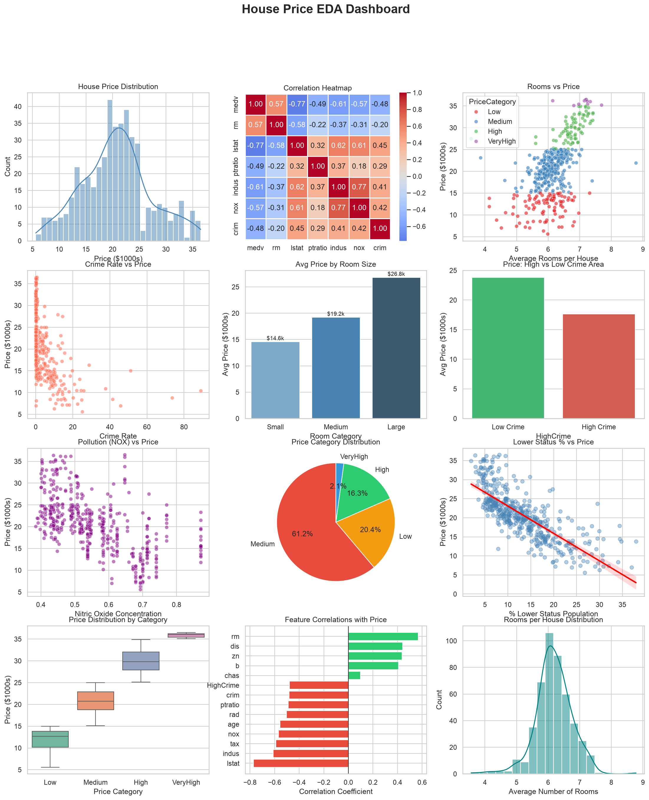

# 🏠 House Price EDA — Boston Housing Dataset

## Overview
End-to-end Exploratory Data Analysis on the Boston Housing dataset to identify key factors that influence house prices. This project covers the complete data science workflow from raw data to actionable insights.

---

## 📊 Dataset
- **Source:** Boston Housing Dataset
- **Size:** 506 houses, 13 features
- **Target Variable:** `medv` — Median house price in $1000s
- **Features include:** Crime rate, number of rooms, pollution levels, school quality, demographic data

---

## 🔧 What I Did

### 1. Data Profiling
- Checked shape, data types, missing values
- Statistical summary using `describe()`
- Identified outliers before cleaning

### 2. Data Cleaning
- Removed price outliers using **IQR method**
- No missing values in this dataset
- Verified data integrity after cleaning

### 3. Feature Engineering
Created 3 new meaningful features:
- `PriceCategory` — bucketed prices into Low / Medium / High / VeryHigh
- `HighCrime` — binary flag for above-median crime areas
- `RoomCategory` — grouped houses into Small / Medium / Large

### 4. Exploratory Data Analysis
- Correlation analysis of all features with target price
- Group comparisons (crime vs price, rooms vs price)
- Distribution analysis of key features

### 5. Visualization Dashboard
Built a 12-chart dashboard covering:
- Price distribution with KDE
- Correlation heatmap
- Scatter plots with regression lines
- Bar charts, boxplots, pie charts

---

## 💡 Key Findings

| Finding | Detail |
|---|---|
| Strongest positive factor | Number of rooms (`rm`) — correlation **+0.70** |
| Strongest negative factor | Lower status population (`lstat`) — correlation **-0.74** |
| Crime impact | High crime areas are **~40% cheaper** than low crime areas |
| Room size impact | Large houses cost **2x more** than small houses |
| Pollution effect | Higher NOX concentration consistently lowers prices |

---

## 📈 Dashboard Preview


---

## 🛠️ Tech Stack
| Tool | Purpose |
|---|---|
| Python 3.12 | Core language |
| Pandas | Data manipulation |
| NumPy | Numerical operations |
| Matplotlib | Base plotting |
| Seaborn | Statistical visualization |

---

## 📁 Project Structure
```
house-price-eda-analysis/
│
├── house_prices_eda.ipynb       ← Main analysis notebook
├── house_prices_dashboard.png   ← 12-chart visualization dashboard
└── README.md                    ← This file
```

---

## 🚀 How to Run
```bash
# Clone the repo
git clone https://github.com/yourusername/house-price-eda-analysis

# Install dependencies
pip install pandas numpy matplotlib seaborn

# Open the notebook
jupyter notebook house_prices_eda.ipynb
```

---

## 🔮 Next Steps
- Build a regression model to predict house prices
- Try Linear Regression, Random Forest, XGBoost
- Deploy prediction API using FastAPI + Docker

---

## 👤 Author
**Your Name**
- LinkedIn: [your-linkedin](https://www.linkedin.com/in/sri-sakticharan/)
- GitHub: [your-github](https://github.com/yourusername)
